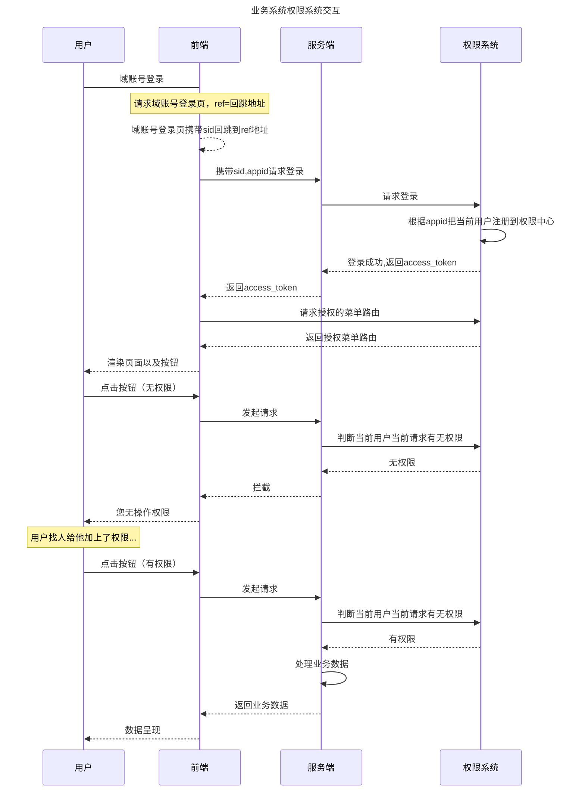

```mermaid
sequenceDiagram
title: 业务系统权限系统交互
participant user as 用户
participant web as 前端
participant server as 服务端
participant permission as 权限系统


user->web: 域账号登录
Note over web:请求域账号登录页，ref=回跳地址
web-->>web: 域账号登录页携带sid回跳到ref地址
web->>server: 携带sid,appid请求登录
server->>permission: 请求登录
permission->>permission: 根据appid把当前用户注册到权限中心
permission-->>server: 登录成功,返回access_token
server-->>web: 返回access_token

web->>permission: 请求授权的菜单路由
permission-->>web: 返回授权菜单路由
web-->>user:渲染页面以及按钮

user->>web:点击按钮（无权限）
web->>server: 发起请求
server->>permission: 判断当前用户当前请求有无权限
permission-->>server: 无权限
server-->>web:拦截
web-->>user: 您无操作权限

note over user: 用户找人给他加上了权限...

user->>web:点击按钮（有权限）
web->>server: 发起请求
server->>permission: 判断当前用户当前请求有无权限
permission-->>server: 有权限
server->>server:处理业务数据
server-->>web: 返回业务数据
web-->>user: 数据呈现

```
